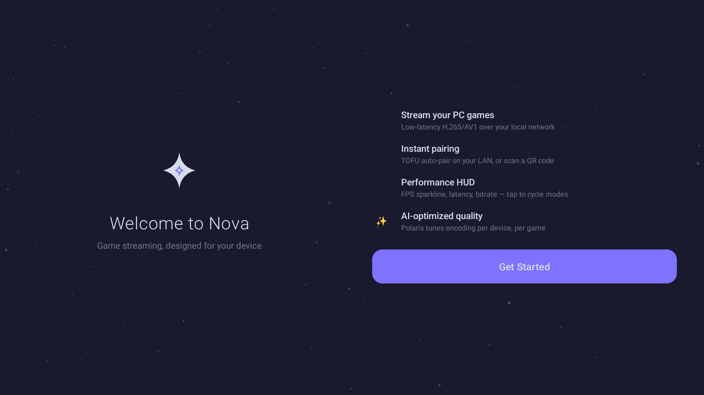
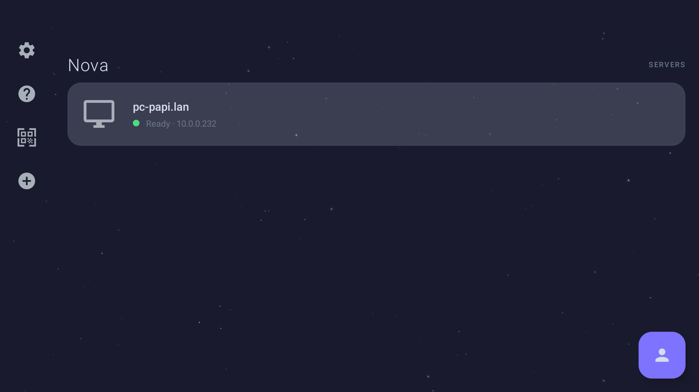
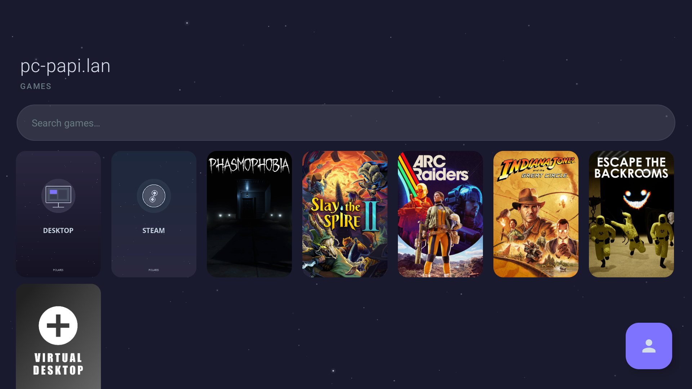
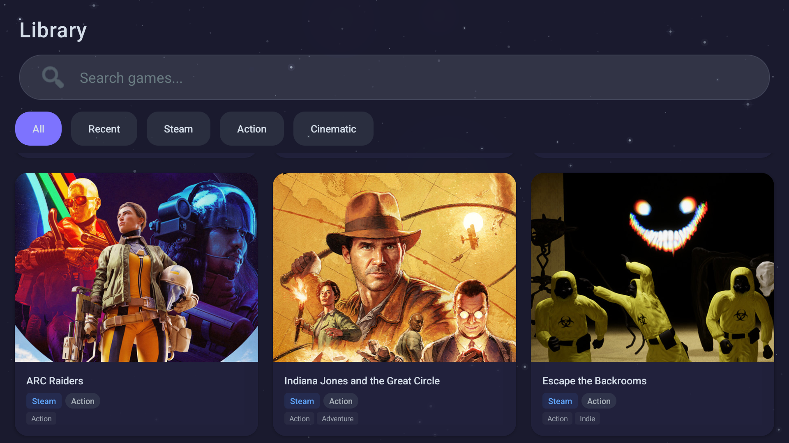
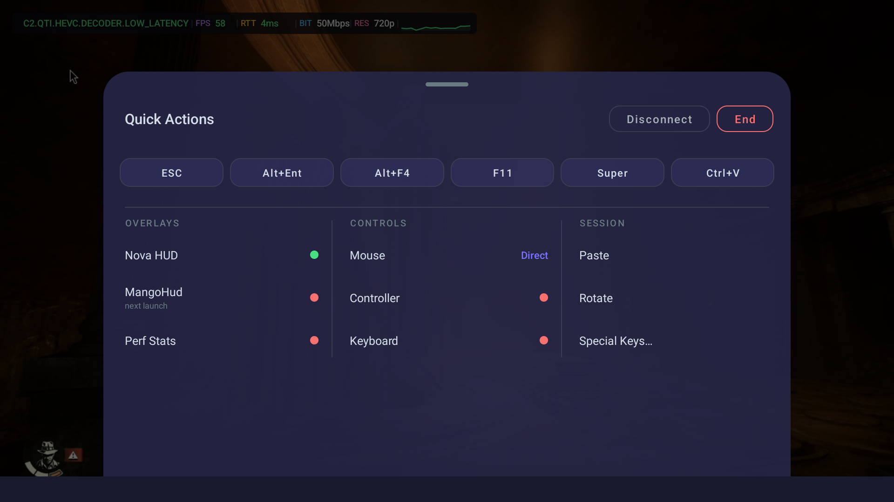
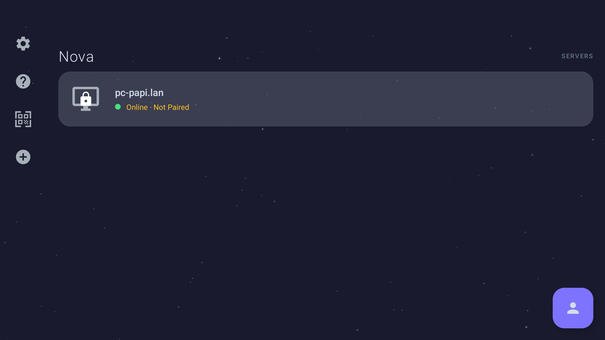
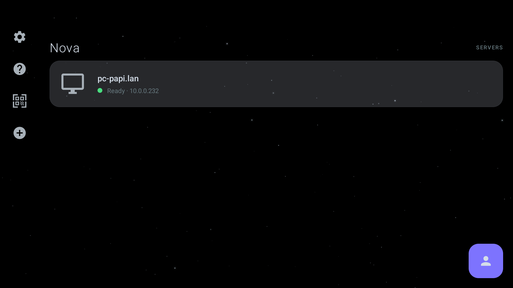
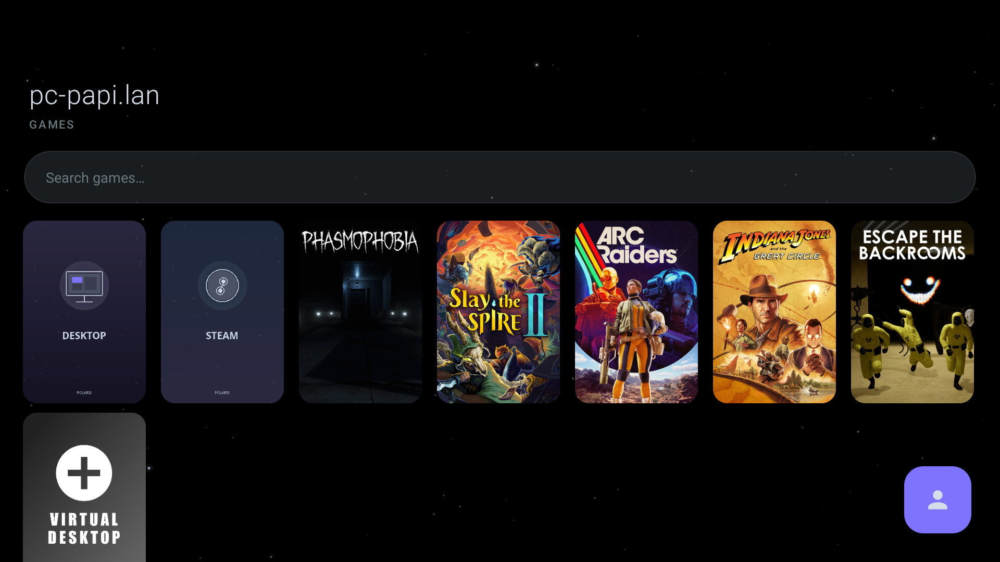
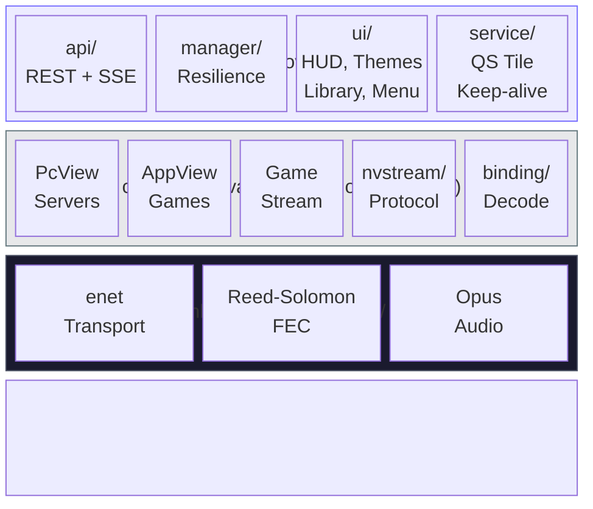

<div align="center">

# Nova

**Game streaming that feels native on Android.**

Stream PC games to your phone or handheld over your local network.
Built for [Polaris](https://github.com/papi-ux/polaris), compatible with any Moonlight server.

[](https://github.com/papi-ux/nova/stargazers)
[](LICENSE.txt)
[](https://github.com/papi-ux/nova/releases/latest)

[Install](#install) · [Features](#features) · [Screenshots](#screenshots) · [Building](#building)

**Support**: [Issues](https://github.com/papi-ux/nova/issues) · **Donate**: [Ko-fi](https://ko-fi.com/papiux) · [PayPal](https://www.paypal.com/donate/?hosted_button_id=KD9R5KLYF6GN4)

<br/>

<picture>
  <source media="(prefers-color-scheme: light)" srcset="docs/screenshots/nova-showcase.gif" width="720" />
  <source media="(prefers-color-scheme: dark)" srcset="docs/screenshots/nova-showcase-oled.gif" width="720" />
  
</picture>

</div>

<br/>

## Install

<div align="center">

[](https://apps.obtainium.imranr.dev/redirect?r=obtainium://app/%7B%22id%22%3A%20%22com.papi.nova%22%2C%20%22url%22%3A%20%22https%3A//github.com/papi-ux/nova%22%2C%20%22author%22%3A%20%22papi-ux%22%2C%20%22name%22%3A%20%22Nova%22%2C%20%22additionalSettings%22%3A%20%22%7B%5C%22apkFilterRegEx%5C%22%3A%5C%22arm64%5C%22%2C%5C%22versionExtractionRegEx%5C%22%3A%5C%22v%28.%2B%29%5C%22%7D%22%7D)
&nbsp;
[](https://github.com/papi-ux/nova/releases/latest)

</div>

> [!NOTE]
> Private repo — Obtainium requires a GitHub Personal Access Token with `repo` scope.

**Target devices:** Retroid Pocket 6 (primary), Pixel 10

---

## What Makes Nova Different

Nova speaks the same Moonlight protocol as every other client — but when connected to a Polaris server, it unlocks features no other client has.

**TOFU Pairing** — Walk into your house, open Nova, you're connected. No PINs, no codes. Devices on your trusted LAN pair automatically.

**Interactive HUD** — Three modes you cycle through with a tap: full panel with FPS sparkline and 1% low metric, a MangoHud-style one-line banner, or a tiny floating FPS pill. Drag it anywhere on screen.

**Quick Menu** — ESC, Alt+Enter, Alt+F4, Super, F11, Ctrl+V — all one tap away. Three-column layout with overlay toggles, input controls, and session actions. MangoHud toggles the server-side overlay for next launch.

**AI Quality** — Nova queries Polaris for Claude-recommended encoding settings per device, per game. Sends session quality reports back at disconnect so the server learns over time.

**Connection Resilience** — Network drops don't kill your session. Nova auto-reconnects with exponential backoff (0s → 1s → 3s → 7s) while showing a visual progress overlay.

**Material You** — Three themes: Space Whale (navy), OLED Dark Galaxy (pure black), or Material You (pulls your Android 12+ system accent color).

---

## Screenshots

<table>
<tr>
<td><br/><sub>Welcome — landscape two-column onboarding</sub></td>
<td><br/><sub>Servers — auto-discovered with status, QR pairing sidebar</sub></td>
</tr>
<tr>
<td><br/><sub>Game grid — cover art from Polaris, search bar, virtual display</sub></td>
<td><br/><sub>Nova Library — genre chips, source badges, category filters</sub></td>
</tr>
<tr>
<td><br/><sub>Quick menu — hotkeys, overlays, controls, session actions</sub></td>
<td><br/><sub>Discovery — "Online · Not Paired" with lock icon, TOFU ready</sub></td>
</tr>
<tr>
<td><br/><sub>OLED Dark Galaxy — true black with space particles</sub></td>
<td><br/><sub>Game grid (OLED) — cover art pops on pure black</sub></td>
</tr>
</table>

---

## Features

**Streaming** — H.264, HEVC, AV1 decode. Streaming presets (Performance / Balanced / Quality) apply with one tap. Proactive bitrate monitor auto-reduces via the Polaris API when FPS drops, gradually recovers when stable.

**Input** — Gyro aiming maps device gyroscope to mouse delta for FPS camera control. Audio haptics convert bass frequencies into vibration (Off / Subtle / Strong). Up to 8 gamepads with USB driver support, per-axis deadzone, face button flip. Mouse modes: Direct, Trackpad, Relative.

**HUD Modes** — Tap to cycle, drag to reposition:

| Mode | Display |
|------|---------|
| Full | Sparkline FPS history, 1% low, per-stat colors, codec + resolution + bitrate |
| Banner | `HEVC │ 60 FPS │ 12ms │ 50 Mbps │ 1080p │ ~~~` |
| FPS Only | Floating pill: `60 fps` |

**Quick Menu** — Bottom sheet with 6 hotkeys (ESC, Alt+Enter, Alt+F4, F11, Super, Ctrl+V), three columns of toggles (Nova HUD, MangoHud, Perf Stats / Mouse, Controller, Keyboard / Paste, Rotate, Special Keys), Disconnect and End buttons.

**Polaris Integration** — Capabilities probing on connect. Live session state via SSE. Game library with cover art, genres, and AI recommendations. Smart launch sends display dimensions for resolution matching. Session reports feed the AI learning loop.

**Background** — Quick Settings tile starts streaming from your notification shade. Keep-alive foreground service on app-switch (5-min auto-stop). Lock screen overlay.

---

## Nova vs Moonlight

| | Nova | Moonlight |
|---|---|---|
| **Pairing** | TOFU + QR code + PIN | PIN only |
| **Performance HUD** | 3 modes, sparkline, drag-to-reposition, proactive bitrate | Static overlay |
| **Reconnection** | 4-attempt auto-reconnect with backoff | — |
| **Input** | Gyro aiming, audio haptics | Standard gamepad/touch |
| **Game library** | Cover art grid, genres, AI recommendations, search | Text list |
| **Settings** | 6 categories, streaming presets | 15+ categories |
| **Themes** | Space Whale + OLED Galaxy + Material You | Single dark |
| **Server integration** | REST API, SSE events, session reports | NVHTTP only |
| **Quick menu** | 3-column with hotkeys, MangoHud toggle | Basic menu |

> [!TIP]
> Nova is fully backward-compatible. It works with Sunshine and Apollo — Polaris features activate automatically when a Polaris server is detected.

---

## Architecture



All new code lives in the Kotlin layer. The Java core is battle-tested Moonlight — targeted modifications only.

---

## Building from Source

### Requirements

| Tool | Version |
|------|---------|
| JDK | 17 |
| Android NDK | 27.0.12077973 |
| Android SDK | compileSdk 36 |
| Git | with submodule support |

### Build

```bash
git clone --recursive https://github.com/papi-ux/nova.git
cd nova

# Release APK (signed with debug key)
./gradlew assembleNonRoot_gameRelease

# Debug APK (separate package ID, can install alongside release)
./gradlew assembleNonRoot_gameDebug
```

Output: `app/build/outputs/apk/nonRoot_game/release/app-nonRoot_game-arm64-v8a-release.apk`

### Install on device

```bash
adb install -r app/build/outputs/apk/nonRoot_game/release/app-nonRoot_game-arm64-v8a-release.apk
```

<details>
<summary><b>Build flavors & tests</b></summary>

| Flavor | Package | Notes |
|--------|---------|-------|
| `nonRoot_game` | `com.papi.nova` | Standard build — use this |
| `nonRoot_gameDebug` | `com.papi.nova.debug` | Debug, installs alongside release |

```bash
./gradlew :app:testNonRoot_gameDebugUnitTest   # Robolectric tests
```

</details>

---

## FAQ

<details>
<summary><b>Does Nova work with Sunshine / Apollo, not just Polaris?</b></summary>

Yes. Nova is a standard Moonlight client — it connects to any Moonlight-compatible server. Polaris-specific features (TOFU pairing, AI optimization, session reports, MangoHud toggle) activate automatically when a Polaris server is detected. Everything else works with Sunshine and Apollo.

</details>

<details>
<summary><b>Why can't I find Nova on the Play Store?</b></summary>

Nova is distributed via GitHub Releases and Obtainium. It's a private repo — Obtainium requires a GitHub Personal Access Token with `repo` scope to check for updates.

</details>

<details>
<summary><b>My server shows "Online · Not Paired"</b></summary>

Your server was discovered but pairing hasn't completed. Three options: **TOFU** (configure `trusted_subnets` on the server — Nova auto-pairs on your LAN), **QR Code** (generate in the Polaris web UI PIN tab, tap the QR icon in Nova), or **Manual PIN** (enter the 4-digit code shown in the server web UI).

</details>

<details>
<summary><b>The stream has audio static/crackle at startup</b></summary>

This was a known issue fixed in v1.4.0. The audio receiver now defers playback until real audio data arrives, eliminating the buffer underrun crackle. Update to the latest version.

</details>

<details>
<summary><b>How do I switch between HUD modes?</b></summary>

Tap the HUD overlay to cycle through modes: Full panel → Banner → FPS only → Off. Drag the HUD to reposition it anywhere on screen. The HUD can be toggled from the Quick Menu under Overlays.

</details>

<details>
<summary><b>Can I use gyro aiming with any game?</b></summary>

Gyro aiming maps your device's gyroscope to mouse movement. It works with any game that accepts mouse input for camera control — most FPS and third-person games. Adjust sensitivity and Y-axis inversion in Settings → Input & Controllers.

</details>

<details>
<summary><b>What's the difference between the three themes?</b></summary>

**Space Whale** (default) — Deep navy backgrounds with ice-blue text and purple accents. **OLED Dark Galaxy** — Pure black backgrounds for OLED screens (saves battery, looks stunning). **Material You** — Pulls your Android 12+ system accent color for a personalized look (falls back to Space Whale on older devices).

</details>

---

<details>
<summary><b>Color Palettes</b></summary>

**Space Whale** (default)

| Swatch | Name | Hex | Role |
|--------|------|-----|------|
|  | Ice | `#d4dde8` | Primary text |
|  | Silver | `#a8b0b8` | Secondary text |
|  | Storm | `#687b81` | Muted |
|  | Twilight | `#4c5265` | Cards |
|  | Void | `#2a2840` | Backgrounds |
|  | Navy | `#1a1a2e` | Window |
|  | Accent | `#7c73ff` | Buttons, links |

**OLED Dark Galaxy**

| Swatch | Name | Hex | Role |
|--------|------|-----|------|
|  | Ice | `#e0e6ed` | Primary text |
|  | Silver | `#a8b0b8` | Secondary text |
|  | Storm | `#555e66` | Muted |
|  | Divider | `#1a1a22` | Dividers |
|  | Abyss | `#0a0a0e` | Cards |
|  | Black | `#000000` | Window |
|  | Accent | `#8b80ff` | Buttons, links |

</details>

---

## Donate

I build Nova and Polaris in my spare time because game streaming on Linux and Android deserves better. If you find it useful, a donation helps keep development going.

[](https://ko-fi.com/papiux)
&nbsp;
[](https://www.paypal.com/donate/?hosted_button_id=KD9R5KLYF6GN4)

Thank you to everyone who's supported the project — you're the reason it keeps getting better.

---

## Contributing

Contributions are welcome — bug fixes, new features, UI polish, translations.

1. Fork the repo and create a branch from `master`
2. Build with `./gradlew assembleNonRoot_gameDebug` and test on a device or emulator
3. New Polaris integration code goes in `com.papi.nova` (Kotlin). Moonlight core changes go in the existing Java layer — targeted modifications only.
4. Open a pull request with a clear description of what changed and why

> [!NOTE]
> The native streaming layer (`app/src/main/jni/moonlight-core/`) is a git submodule. Run `git submodule update --init --recursive` after cloning.

---

## License

Nova is licensed under the **GNU General Public License v3.0** — see [LICENSE.txt](LICENSE.txt) for the full text.

Nova is a fork of [Artemis](https://github.com/ClassicOldSong/moonlight-android) by ClassicOldSong, which is itself a fork of [Moonlight Android](https://github.com/moonlight-stream/moonlight-android) by Cameron Gutman, Diego Waxemberg, Aaron Neyer, and Andrew Hennessy. All are GPLv3. The native streaming core is [moonlight-common-c](https://github.com/moonlight-stream/moonlight-common-c).
