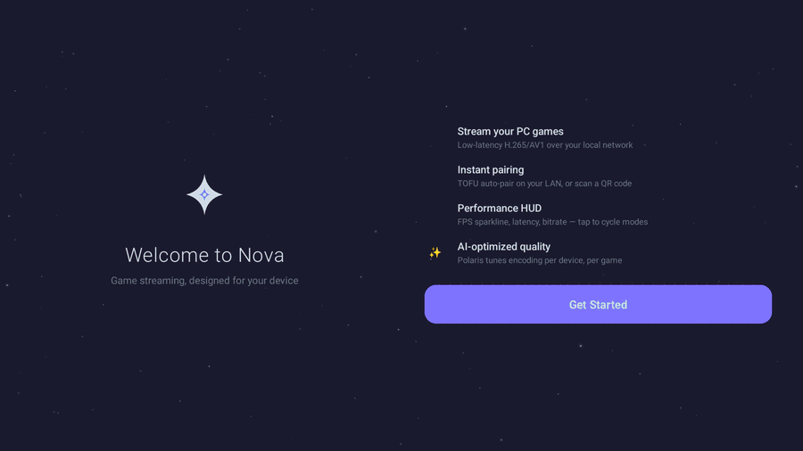
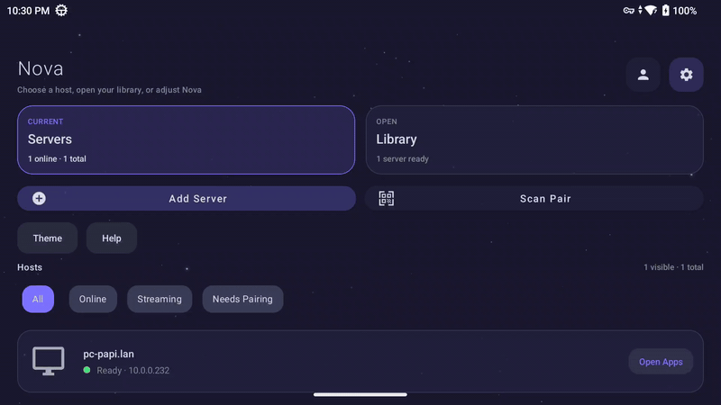
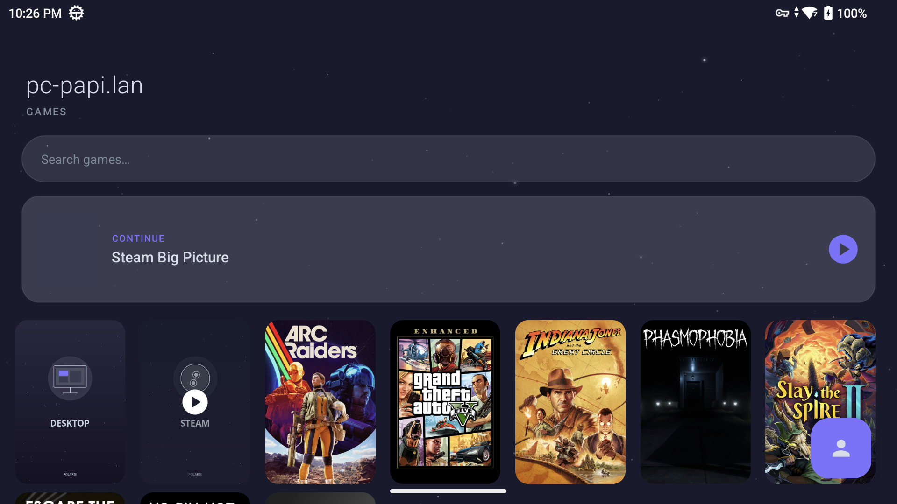
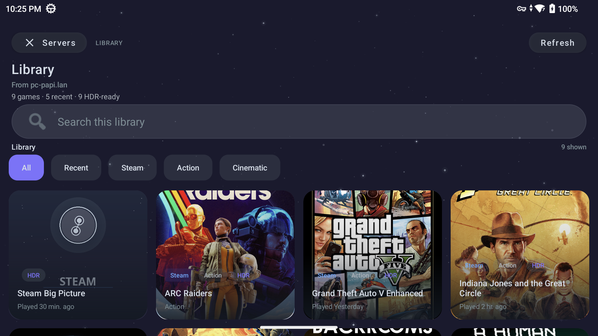
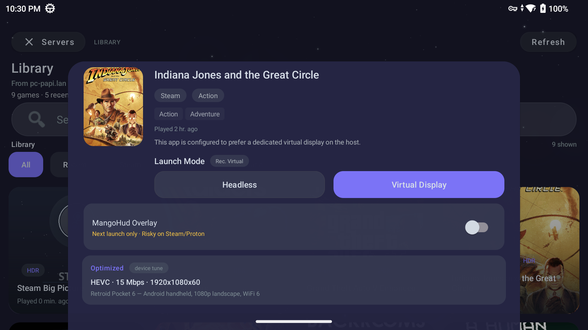
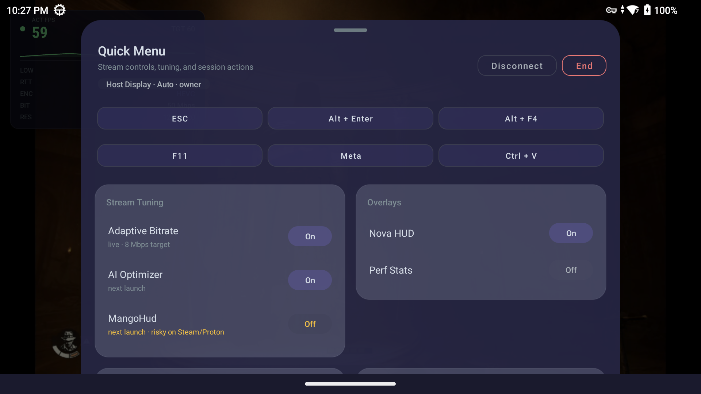
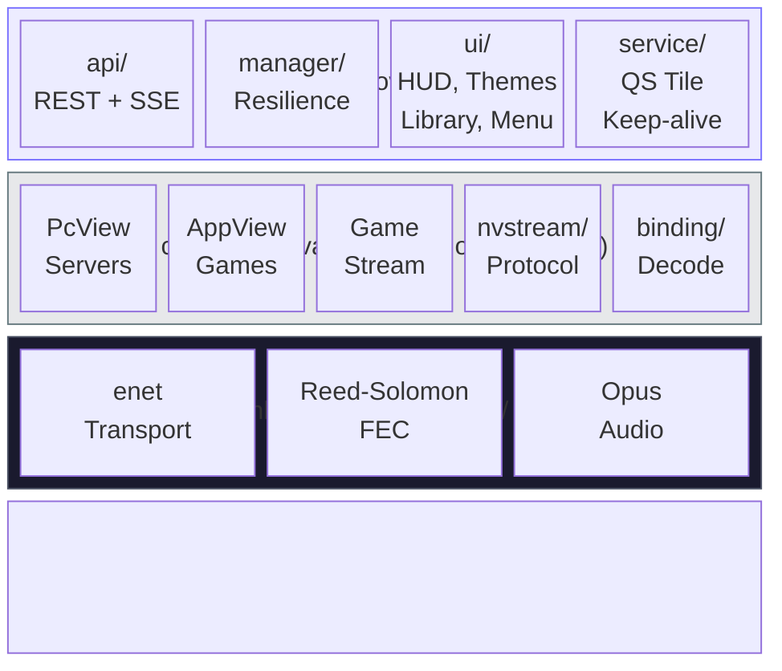

<div align="center">

# Nova

**Game streaming that feels native on Android.**

Stream PC games to phones and handhelds over your local network.
Built for [Polaris](https://github.com/papi-ux/polaris), compatible with Moonlight-compatible hosts such as Polaris, Sunshine, and Apollo.

[](https://github.com/papi-ux/nova/stargazers)
[](LICENSE.txt)
[](https://github.com/papi-ux/nova/releases/latest)

[Install](#install) · [Quick Start](#quick-start) · [Compatibility](#compatibility) · [Known Limitations](#known-limitations) · [Why Nova](#why-nova) · [With Polaris](#with-polaris) · [Screenshots](#screenshots) · [Build](#build-from-source) · [FAQ](#faq)

**Support**: [Issues](https://github.com/papi-ux/nova/issues) · **Donate**: [Ko-fi](https://ko-fi.com/papiux) · [PayPal](https://www.paypal.com/donate/?hosted_button_id=KD9R5KLYF6GN4)

<br/>

<picture>
  
</picture>

</div>

<br/>

## Install

<div align="center">

[](https://apps.obtainium.imranr.dev/redirect?r=obtainium://app/%7B%22id%22%3A%20%22com.papi.nova%22%2C%20%22url%22%3A%20%22https%3A//github.com/papi-ux/nova%22%2C%20%22author%22%3A%20%22papi-ux%22%2C%20%22name%22%3A%20%22Nova%22%2C%20%22additionalSettings%22%3A%20%22%7B%5C%22apkFilterRegEx%5C%22%3A%5C%22arm64%5C%22%2C%5C%22versionExtractionRegEx%5C%22%3A%5C%22v%28.%2B%29%5C%22%7D%22%7D)
&nbsp;
[](https://github.com/papi-ux/nova/releases/latest)

</div>

**Recommended install path**

1. Download the latest release from GitHub Releases or add Nova to Obtainium.
2. Install the Android release APK: `app-nonRoot_game-arm64-v8a-release.apk`.
3. Open Nova, add or discover your host, then pair it.

> [!NOTE]
> If you distribute Nova from a private GitHub fork, Obtainium needs a Personal Access Token with `repo` scope. Public release repos do not.

**Built and tested most heavily on:** Retroid Pocket 6, Retroid Pocket Flip 2, Pixel 10 Pro.

## Quick Start

### First stream

1. **Install Nova** from Obtainium or GitHub Releases.
2. **Add your server** from the Servers screen. Polaris hosts appear automatically on the LAN when discovery is enabled.
3. **Pair once** using one of three paths:
   - **Trusted Pair (TOFU)** on a trusted subnet
   - **QR pairing** from the Polaris web UI
   - **Manual PIN** pairing for standard Moonlight servers
4. **Launch a game** from the game grid or the Polaris library.
5. **Use the quick menu** for stream tuning, overlays, controller actions, and quit/disconnect controls.

### If you use Polaris

Nova gets the best experience when the host is Polaris:

- featured **Continue** surface with live/watch state, cover art, and one-tap resume
- host-recommended **Headless** or **Virtual Display** launch modes
- live **ACT / TGT FPS** HUD readouts
- watch active stream without stealing ownership
- owner-aware quit and resume
- clear **Baseline / AI tune / Cached AI / Recovery tune** labels in Polaris-backed flows
- live host tuning for Adaptive Bitrate, AI Optimizer, and MangoHud
- richer library metadata, cover art, and per-game recommendations

### If you use Sunshine or Apollo

Nova still works as a standard Moonlight client. Pair normally, launch normally, and stream normally. Polaris-only UI simply stays out of the way.

## Compatibility

| Area | Status | Notes |
|---|---|---|
| Android handhelds | Primary target | Designed first for landscape handheld use |
| Android phones and tablets | Supported | Works well, but the UX is tuned most heavily for handhelds |
| Polaris | Best experience | Full launch-mode, watch-mode, tuning, library, and live-session integration |
| Sunshine / Apollo | Compatible | Standard Moonlight-compatible client flow |
| High refresh devices | Supported | Nova can request 90/120 Hz when the device display and host both support it |
| Official release asset | `arm64-v8a` | Public GitHub Releases currently ship `app-nonRoot_game-arm64-v8a-release.apk` |

## Known Limitations

- Advanced launch modes, watch mode, live host tuning, and richer session telemetry are Polaris-specific.
- Nova is not on the Play Store; the public install path is GitHub Releases or Obtainium.
- High refresh streaming is limited by the real display panel on the Android device, not just the selected setting in Nova.
- The public release asset is currently `arm64-v8a` only. Other ABIs are available from local source builds.

## Why Nova

Nova is a Moonlight-compatible Android client built for handhelds first, not desktop assumptions squeezed onto a touch screen.

- **Handheld-first UI**: large game art, clear session actions, controller-friendly navigation, and OLED-aware themes
- **Clear launch surfaces**: host library screens keep the primary action obvious instead of burying resume/watch behind generic grids
- **Practical session controls**: quick menu, multi-mode HUD, reconnect overlay, and live stream state
- **Deep input support**: gyro aim, audio haptics, gamepads, mouse modes, and touch controls
- **Polaris-aware workflow**: library metadata, launch-mode choices, watch mode, session ownership, live tuning, and stream reports

## With Polaris

| Capability | What It Does |
|---|---|
| Launch modes | Pick **Headless** or **Virtual Display** per launch when the host supports it |
| 10-bit opt-in | Enabling HDR can request a 10-bit stream even on SDR handheld displays |
| Watch Stream | Join an active session as a passive viewer instead of taking ownership |
| Session truth | HUD and quick menu show the live mode, owner/viewer role, and negotiated stream state |
| AI state | Library and quick menu can distinguish baseline device tuning, live AI, cached AI, recovery tuning, and host-adjusted recommendations |
| Stream tuning | Toggle Adaptive Bitrate, AI Optimizer, and MangoHud from the quick menu |
| Library | Cover art, genres, source badges, recommendations, and per-game launch guidance |

## Feature Summary

| Area | What You Get |
|---|---|
| Pairing | Trusted Pair (TOFU), QR, manual PIN |
| Streaming | H.264, HEVC, AV1 decode |
| HUD | Full, banner, FPS-only modes with actual vs target FPS |
| Input | Gyro aim, audio haptics, gamepads, mouse modes |
| Polaris | Library metadata, launch modes, tuning, watch mode, session reports |
| Background | Quick Settings tile, keep-alive service, lock screen overlay |

## Screenshots

<table>
<tr>
<td><br/><sub>Main menu and theme system</sub></td>
<td><br/><sub>Nova HUD modes and on-stream toggles</sub></td>
</tr>
<tr>
<td><br/><sub>Games home with Continue rail and host shortcuts</sub></td>
<td><br/><sub>Polaris library with filters, search, and HDR-ready badges</sub></td>
</tr>
<tr>
<td><br/><sub>Per-game launch modes and next-launch tuning</sub></td>
<td><br/><sub>Quick menu for tuning, overlays, controls, and session actions</sub></td>
</tr>
</table>

## Highlights

### Streaming and HUD

- H.264, HEVC, and AV1 decode
- Full, banner, and FPS-only HUD modes
- actual FPS vs target FPS labels, not one ambiguous number
- reconnect overlay with retry/backoff instead of dropping immediately
- quality presets for quick setup on new devices

### Input

- gyro aiming mapped to mouse delta
- audio haptics with Off / Subtle / Strong modes
- broad controller support with deadzone and face-button options
- multiple mouse modes: Direct, Trackpad, Relative
- on-screen controls with a newer compact handheld layout preset

### Polaris-specific flow

- host-backed library with authenticated cover loading
- featured Continue card with cover art, live/watch state, and one-tap resume or watch
- explicit Headless vs Virtual Display launch buttons in the library
- host-recommended launch mode and reason text
- owner vs viewer session awareness
- AI recommendation source labels and host-adjusted runtime notes in Polaris-backed surfaces
- live tuning controls in the quick menu
- warnings before risky MangoHud launches on Steam Big Picture and Steam/Proton titles

## Nova vs Standard Moonlight UI

| | Nova | Standard Moonlight-style client flow |
|---|---|---|
| Pairing | Trusted Pair (TOFU), QR, PIN | Usually PIN-focused |
| Library | Cover art, filters, metadata, detail sheet | Mostly app list / grid |
| HUD | Multiple modes, draggable, ACT/TGT view | Simpler overlay |
| Quick controls | Stream tuning, session actions, overlays | More limited session controls |
| Polaris awareness | Launch modes, watch mode, live session state | Generic Moonlight protocol only |
| Handheld UX | Built around landscape Android handhelds | More generic phone/tablet UI |

> [!TIP]
> Nova stays fully backward-compatible. It works with Sunshine, Apollo, and other Moonlight servers. Polaris-specific features appear only when the connected host supports them.

<details>
<summary><b>Architecture</b></summary>



All new Nova-specific behavior lives in the Kotlin layer. The Java core stays close to Moonlight and is changed surgically.

</details>

## Build From Source

### Requirements

| Tool | Version |
|------|---------|
| JDK | 17 |
| Android NDK | 27.0.12077973 |
| Android SDK | compileSdk 36 |
| Git | with submodule support |

### Clone

```bash
git clone --recursive https://github.com/papi-ux/nova.git
cd nova
```

### Build

```bash
# Release APKs
./gradlew assembleNonRoot_gameRelease

# Debug APKs (installs alongside release as com.papi.nova.debug)
./gradlew assembleNonRoot_gameDebug
```

By default, local source builds produce split APKs for `arm64-v8a` and `x86_64`.

> [!TIP]
> Official GitHub releases ship a signed `arm64-v8a` APK for real devices as `app-nonRoot_game-arm64-v8a-release.apk`.
>
> If you want a different ABI set locally:
> `./gradlew assembleNonRoot_gameDebug -PnovaAbis=arm64-v8a,armeabi-v7a,x86,x86_64`

### Install on device

Use the ABI-specific APK that matches your device from `app/build/outputs/apk/nonRoot_game/<buildType>/`.

Example for a real arm64 device:

```bash
adb install -r app/build/outputs/apk/nonRoot_game/debug/app-nonRoot_game-arm64-v8a-debug.apk
```

<details>
<summary><b>Build flavors and tests</b></summary>

| Flavor | Package | Notes |
|--------|---------|-------|
| `nonRoot_game` | `com.papi.nova` | Standard release build |
| `nonRoot_gameDebug` | `com.papi.nova.debug` | Debug build, installs alongside release |

```bash
./gradlew :app:testNonRoot_gameDebugUnitTest
```

</details>

## FAQ

<details>
<summary><b>Does Nova work with Sunshine and Apollo, not just Polaris?</b></summary>

Yes. Nova is a Moonlight-compatible client. Polaris adds the richest integration, but Nova still works with other Moonlight servers.

</details>

<details>
<summary><b>What is Trusted Pair?</b></summary>

Trusted Pair is Nova’s TOFU flow. If Polaris trusts the subnet you are on, Nova can complete first pairing without the usual PIN ceremony. You can still use QR or manual PIN pairing when you want the traditional flow.

</details>

<details>
<summary><b>What is the difference between Headless and Virtual Display?</b></summary>

**Headless** launches against Polaris’ isolated compositor path without touching your physical desktop layout. **Virtual Display** asks the host for a virtual display-backed launch instead. Nova’s Polaris library now shows what the host recommends, what the app prefers, and which modes are currently allowed.

</details>

<details>
<summary><b>Can Nova request a 10-bit stream on an SDR display?</b></summary>

Yes. When you explicitly enable HDR in Nova and the server supports Main10, Nova can request a 10-bit stream even if the handheld screen itself does not advertise HDR10. This is especially useful with Polaris on handhelds such as Retroid devices.

</details>

<details>
<summary><b>What does Watch Stream do?</b></summary>

Watch Stream lets a second device join an already running Polaris session as a passive viewer. It does not take ownership, and viewer sessions are limited to the active stream profile rather than silently renegotiating their own version.

</details>

<details>
<summary><b>Why does Nova warn me before enabling MangoHud?</b></summary>

On Polaris-backed Steam Big Picture and Steam/Proton titles, MangoHud can crash helper processes early enough to leave the session black-screened. Nova flags those launches before you enable MangoHud so the safer choice is obvious.

</details>

<details>
<summary><b>Why can't I find Nova on the Play Store?</b></summary>

Nova is distributed through GitHub Releases and Obtainium. The official public release path is GitHub first.

</details>

## AI Transparency

Nova is built with help from AI tools, including Anthropic Claude, OpenAI Codex, and local models.

I use them as engineering assistants for brainstorming, UI exploration, debugging, refactoring, tests, and documentation. Final design choices, code review, integration, and release decisions are still mine, and anything shipped in this repo is manually reviewed and tested before release.

## Contributing

Contributions are welcome: bug fixes, features, UI polish, documentation, and translations.

1. Fork the repo and branch from `master`.
2. Build with `./gradlew assembleNonRoot_gameDebug`.
3. Test on a real device or emulator.
4. Open a pull request that clearly explains what changed and why.

> [!NOTE]
> The native streaming layer in `app/src/main/jni/moonlight-core/` is a git submodule. Run `git submodule update --init --recursive` after cloning.

## Donate

I build Nova and Polaris in my spare time because game streaming on Linux and Android deserves better tooling. If Nova is useful to you, donations help keep development moving.

[](https://ko-fi.com/papiux)
&nbsp;
[](https://www.paypal.com/donate/?hosted_button_id=KD9R5KLYF6GN4)

## License

Nova is licensed under the **GNU General Public License v3.0**. See [LICENSE.txt](LICENSE.txt) for the full text.

Nova is a fork of [Artemis](https://github.com/ClassicOldSong/moonlight-android) by ClassicOldSong, which is itself a fork of [Moonlight Android](https://github.com/moonlight-stream/moonlight-android) by Cameron Gutman, Diego Waxemberg, Aaron Neyer, and Andrew Hennessy. All are GPLv3. The native streaming core is [moonlight-common-c](https://github.com/moonlight-stream/moonlight-common-c).
