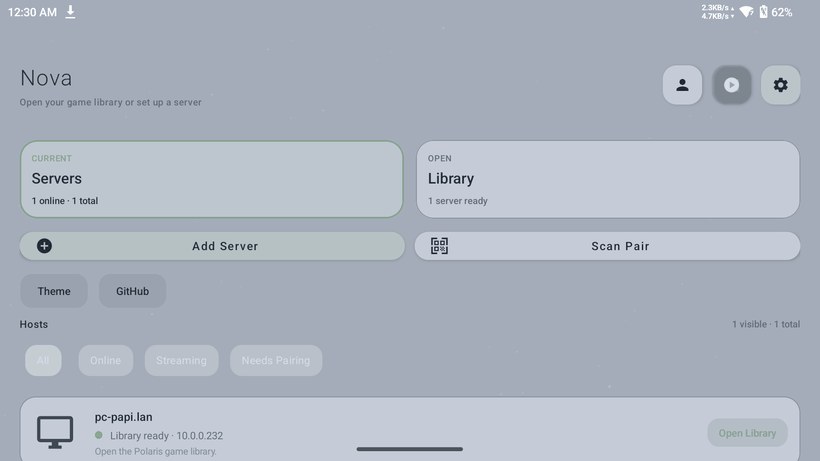
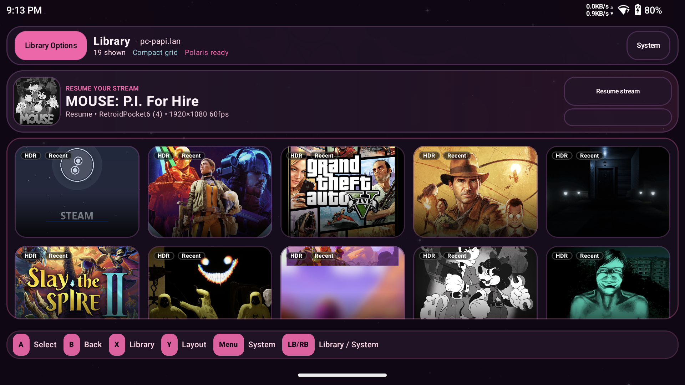
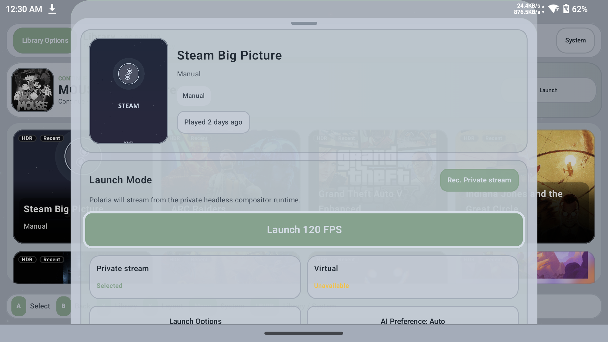
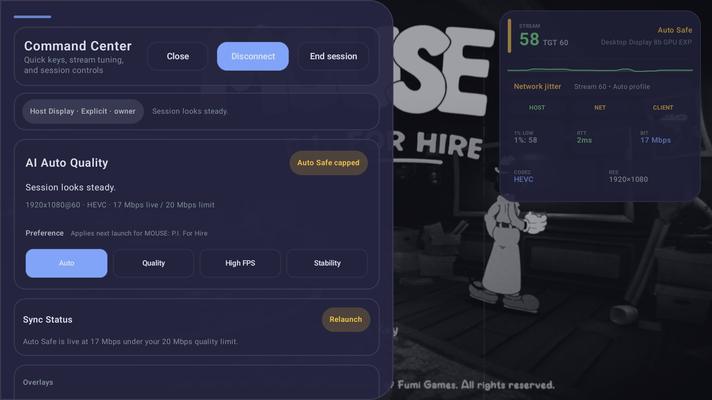
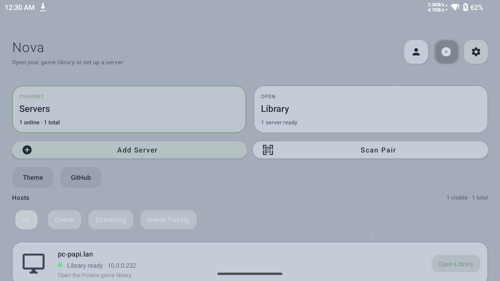

<div align="center">

# Nova

**Game streaming for Android handhelds that understands the host.**

Nova streams PC games from Polaris or any Moonlight-compatible host, but it is
built for the parts normal clients barely explain: launch modes, active sessions,
host tuning, stream health, controller focus, and safe disconnects.

With Polaris, Nova can show what will happen before you launch, what is happening
while you play, and what is safe to do when you leave.

[](https://github.com/papi-ux/nova/stargazers)
[](LICENSE.txt)
[](https://github.com/papi-ux/nova/releases/latest)

[Why Nova](#why-nova) · [Quick Start](#quick-start) · [Latest Release](#latest-release-v112) · [Install](#install) · [Compatibility](#compatibility) · [Tour](#tour) · [Polaris](#use-with-polaris) · [Docs](#docs) · [FAQ](#faq) · [Security](SECURITY.md) · [Changelog](CHANGELOG.md) · [Roadmap](ROADMAP.md)

**Support**: [Issues](https://github.com/papi-ux/nova/issues) · [Discussions](https://github.com/papi-ux/nova/discussions)

<br/>

<picture>
  
</picture>

</div>

> [!IMPORTANT]
> Nova is an Android client today. It is built and tested most heavily on handheld Android devices, Android TV, and modern phones, with the richest experience coming from [Polaris](https://github.com/papi-ux/polaris).

> [!NOTE]
> Nova still speaks the Moonlight/GameStream client path. Polaris unlocks the richer Library, launch, watch, tuning, and session-state surfaces, but standard Moonlight-compatible hosts remain usable.

## Why Nova

Most game-streaming clients give you pairing, a grid, and a video stream. That is enough until you are on an Android handheld, the host is already running something, and you need to know whether pressing a button will resume, watch, relaunch, disconnect, or kill the session.

Nova is built for that messy reality.

- Know what will launch before you press play.
- See whether a session is active, resumable, watchable, or owned by another device.
- Pick Private Stream or Virtual Display when Polaris supports both.
- Tune and inspect the stream from Command Center without leaving the session.
- Use NovaHUD for live FPS, target FPS, host limits, and stream health.
- Keep controller focus readable on handhelds and Android TV.

| Normal streaming client | Nova with Polaris |
|---|---|
| Shows a flat app list | Shows a host-backed Library with cover art, filters, source badges, and launch context |
| Starts whatever the host decides | Shows Private Stream, Virtual Display, recommendations, and availability before launch |
| Hides session state | Shows active, resumable, watchable, and owner-aware session states |
| Leaves tuning to guesswork | Shows Auto Quality, target FPS, host limits, and tuning provenance |
| Treats disconnect and quit as generic actions | Separates safe disconnect from ending the host session |
| Assumes touch or TV navigation will be good enough | Keeps handheld and D-pad focus visible first |

| Browse | Decide | Control |
|---|---|---|
|  |  |  |
| Host-backed Library with filters, art, and active-session state | Private Stream or Virtual Display choices with host recommendations | Command Center, NovaHUD, tuning, reconnect, and safe disconnect |

## Quick Start

### First stream

1. Install Nova from GitHub Releases, Obtainium, or GitHub Store.
2. Open **Servers** and add or discover a host. Polaris hosts appear automatically on the LAN when discovery is enabled.
3. Pair with **Trusted Pair** on a trusted Polaris subnet, **QR pairing** from the Polaris web UI, or normal **manual PIN** pairing.
4. Launch from the standard game grid or the Polaris-powered Library.
5. During a stream, open Command Center for tuning, overlays, controller actions, and quit/disconnect controls. Guide/Mode + Start/Menu opens Command Center, and Guide/Mode + Y shows or cycles NovaHUD.

### Recommended first setup

| Device | Start here |
|---|---|
| Android handheld or phone | `Nova-Android-arm64-v8a.apk` |
| NVIDIA Shield or ARM64 Android TV | `Nova-Android-arm64-v8a.apk` |
| Chromecast with Google TV, Google TV Streamer, or 32-bit ARM Android TV | `Nova-Android-armeabi-v7a.apk` |
| Android x86_64 device or emulator | `Nova-Android-x86_64.apk` |

If a sleeping host does not report a MAC address, open the host menu and choose **Edit Wake-on-LAN MAC**. Nova stores that address and reuses it for future wake requests, which helps VPN and routed setups where discovery metadata is incomplete.

## Latest release: v1.1.2

Nova `v1.1.2` is a confidence patch for the 1.1 line. It makes the Polaris Library more truthful when host metadata is incomplete, improves stale-session recovery, adds the requested Insert key affordance, and rolls in crash/input/dependency hardening from the current release branch.

- **Safer Library truth**: incomplete fallback app-list data stays out of the Library, and fallback failures use clearer in-app provenance instead of confusing legacy wording.
- **Stale stream recovery**: owned active sessions now expose **End session** next to **Resume stream**, so users have a first-screen escape hatch when a host session goes stale.
- **Insert in Quick Keys**: Command Center Quick Keys and More Keys / Send special keys now include **Insert** for tools and overlays that bind to it.
- **Clearer high-FPS copy**: 120 FPS wording now describes the **High FPS stream** target instead of implying the game itself is guaranteed to render at 120.
- **Input and crash hardening**: stylus pen events reach the pressure-capable path before pointer-capture mouse gates, and malformed app data no longer trips the app grid.
- **Release validation**: current master passed public hygiene, lint/unit, CodeQL, dependency submission, release APK assembly, and a Retroid ARM64 stream/control cleanup smoke.

See the [changelog](CHANGELOG.md) for the full release history.

## Install

<div align="center">

[](https://apps.obtainium.imranr.dev/redirect?r=obtainium://app/%7B%22id%22%3A%22com.papi.nova%22%2C%22url%22%3A%22https%3A%2F%2Fgithub.com%2Fpapi-ux%2Fnova%22%2C%22author%22%3A%22papi-ux%22%2C%22name%22%3A%22Nova%22%2C%22additionalSettings%22%3A%22%7B%5C%22apkFilterRegEx%5C%22%3A%5C%22Nova-Android-arm64-v8a%5C%5C%5C%5C.apk%24%5C%22%2C%5C%22versionExtractionRegEx%5C%22%3A%5C%22v%28.%2B%29%5C%22%2C%5C%22matchGroupToUse%5C%22%3A%5C%221%5C%22%7D%22%7D)
&nbsp;
[](https://github-store.org/app?repo=papi-ux/nova)
&nbsp;
[](https://github.com/papi-ux/nova/releases/latest)
&nbsp;
[](https://github.com/papi-ux/nova/releases/latest/download/Nova-Android-arm64-v8a.apk)

</div>

Use the public release APK that matches your device:

| Public release asset | Use it for |
|---|---|
| `Nova-Android-arm64-v8a.apk` | Recommended Android install for phones, handhelds, and ARM64 Android TV devices |
| `Nova-Android-armeabi-v7a.apk` | Chromecast with Google TV, Google TV Streamer, and other Android TV devices that expose only 32-bit ARM app support |
| `Nova-Android-x86_64.apk` | Android x86_64 devices and emulators |
| `*.apk.sha256` | Integrity checks for public APKs |

The Obtainium shortcut is preconfigured for the ARM64 public asset so updates resolve to one APK cleanly. Chromecast and other 32-bit ARM Android TV users should choose the `armeabi-v7a` asset manually or configure Obtainium to match `Nova-Android-armeabi-v7a.apk`.

The latest direct APKs are always available through GitHub's latest-release URLs: `https://github.com/papi-ux/nova/releases/latest/download/Nova-Android-arm64-v8a.apk`, `https://github.com/papi-ux/nova/releases/latest/download/Nova-Android-armeabi-v7a.apk`, and `https://github.com/papi-ux/nova/releases/latest/download/Nova-Android-x86_64.apk`.

F-Droid and IzzyOnDroid packaging notes are tracked in [docs/fdroid.md](docs/fdroid.md), including current status, APK scan notes, and source-build blockers.

If you install manually, verify the download before sideloading:

```bash
sha256sum -c Nova-Android-arm64-v8a.apk.sha256
```

> [!TIP]
> If you distribute Nova from a private GitHub fork, Obtainium needs a Personal Access Token with `repo` scope. Public release repos do not.

## Compatibility

| Area | Status | Notes |
|---|---|---|
| Android handhelds | Primary target | Designed first for landscape handheld use |
| Android phones and tablets | Supported | Works well, with the UX tuned most heavily for handheld play |
| Android TV | Supported | Uses ARM64 or 32-bit ARM APKs with Leanback launcher support and D-pad/controller-friendly browsing |
| Polaris | Best experience | Full launch-mode, watch-mode, tuning, library, profile sync, and live-session integration |
| Other Moonlight-compatible hosts | Compatible | Standard Moonlight-compatible client flow |
| Steam Controller 2026 | Partial Android HID support | Android may expose Bluetooth mode as a Valve keyboard/mouse HID; Nova recognizes common Valve HID names for host gamepad presence and compatible D-pad/button events |
| Wake-on-LAN | Supported | Sends UDP magic packets directly from Android and supports manual MAC entry |
| High refresh devices | Supported | Nova can request 90/120 Hz when the device display and host both support it |
| Official release assets | `arm64-v8a`, `armeabi-v7a`, `x86_64` | Public GitHub Releases ship separate APKs per Android ABI |

## Known Limitations

- Advanced launch modes, watch mode, live host tuning, richer session telemetry, and Polaris Sync are Polaris-specific.
- Nova is not on the Play Store. The public install paths are GitHub Releases, Obtainium, and GitHub Store.
- High refresh streaming is limited by the real display panel on the Android device, not just the selected setting in Nova.
- Steam Controller 2026 Bluetooth support depends on the HID shape Android exposes. Nova can recognize Valve keyboard/mouse HID presentations and route compatible controller-like keys, but Android does not expose full Steam Input profiles or hidden analog controls through a standard gamepad source.
- Today, only the Android client ships.

## Use With Polaris

[Polaris](https://github.com/papi-ux/polaris) is the Linux host built alongside Nova. Pair them and Nova stops guessing: the host can tell the client which launch modes are available, who owns the current session, what tuning is active, and what is safe to do next.

| Polaris + Nova capability | What it means |
|---|---|
| Launch contract | Polaris tells Nova which launch modes are preferred, recommended, and currently allowed |
| Private Stream vs Virtual Display | Nova can present both choices directly in the library instead of silently guessing |
| 10-bit SDR | Nova can explicitly request a Main10 stream even on SDR handheld panels when the host supports it |
| Watch Stream | A second device can join as a viewer without taking over the owner session |
| Tuning provenance | Nova can distinguish baseline device tuning, live AI, cached AI, recovery tuning, host-adjusted recommendations, and active target profiles |
| Polaris Sync | Push Nova stream defaults to Polaris, pull Polaris' current profile back into Nova, or keep Polaris matched to Nova defaults |
| Live tuning | Auto Quality and MangoHud can be surfaced directly in Command Center |
| Session state | HUD and Command Center can show live server-backed mode, role, shutdown state, and tuning state |

## Tour

### Handheld Dashboard

Nova opens on a controller-friendly dashboard for servers, themes, help, and streaming entry points. Focus states are built to stay readable on handhelds and Android TV instead of disappearing into pretty artwork.

<p align="center">
  <picture>
    
  </picture>
</p>

### Polaris Library

The Polaris library gives Nova the context a plain app list cannot: cover art, filters, source badges, launch modes, Continue/watch states, host recommendations, and per-game guidance before you start a stream.

<table>
  <tr>
    <td width="50%" valign="top">
      <picture>
        
      </picture>
      <p><strong>Library grid</strong><br/>Browse a real host-backed library with cover art, filters, source badges, active-session state, and D-pad focus that stays visible.</p>
    </td>
    <td width="50%" valign="top">
      <picture>
        
      </picture>
      <p><strong>Launch detail</strong><br/>Choose Private Stream or Virtual Display, review host recommendations, and see next-launch tuning before starting.</p>
    </td>
  </tr>
</table>

### Stream Controls

During a stream, Nova shifts from browsing to operations. Command Center, HUD modes, tuning actions, reconnect state, input helpers, and disconnect controls stay reachable without leaving the session.

<table>
  <tr>
    <td width="50%" valign="top">
      <picture>
        
      </picture>
      <p><strong>Command Center</strong><br/>Tune, toggle overlays, inspect the active session, disconnect safely, or end the host session when you mean it.</p>
    </td>
    <td width="50%" valign="top">
      <picture>
        
      </picture>
      <p><strong>NovaHUD</strong><br/>Cycle full, banner, and FPS-only telemetry with controller shortcuts.</p>
    </td>
  </tr>
</table>

<details>
<summary><b>Theme system</b></summary>

<p align="center">
  <picture>
    
  </picture>
</p>

</details>

## How It Works

Nova keeps the Moonlight-compatible stream path, then layers a Kotlin Android experience around host awareness, controller-first navigation, profile-aware settings, and Polaris session metadata.

The practical result: standard hosts still work, while Polaris hosts can tell Nova more about what is launching, who owns the session, what tuning is active, and what settings should apply next. The native streaming layer stays close to Moonlight lineage; the newer Nova behavior lives in the Android/Kotlin layer.

For the deeper source layout and build model, see [Technical Overview](docs/technical-overview.md).

## Docs

| Guide | Use it for |
|---|---|
| [Technical Overview](docs/technical-overview.md) | Source layout, architecture, local builds, tests, APK outputs |
| [F-Droid Packaging Notes](docs/fdroid.md) | F-Droid and IzzyOnDroid packaging status |
| [Kotlin Optimization Audit](docs/kotlin_optimization_audit.md) | Kotlin migration and optimization notes |
| [Video Baseline Evidence](docs/video_baseline_evidence.md) | Baseline profile and release-performance evidence |
| [JNI Bridge Measurement](docs/jni_bridge_measurement.md) | Measurement gate for future JNI annotation work |
| [Multi-platform Study](docs/multi_platform_monorepo.md) | Native client expansion notes |
| [Steam Deck Native Port Study](docs/steam_deck_native_port_study.md) | Steam Deck client research |

## Build From Source

Clone with submodules, then build the Android APKs:

```bash
git clone --recursive https://github.com/papi-ux/nova.git
cd nova
./gradlew assembleNonRoot_gameDebug
```

If you cloned without `--recursive`, initialize the native streaming submodule before building:

```bash
git submodule update --init --recursive
```

Nova pins Android NDK `27.0.12077973`. Local builds produce split APKs for `arm64-v8a`, `armeabi-v7a`, and `x86_64` by default. Release builds, test commands, local ABI overrides, and the architecture diagram live in [Technical Overview](docs/technical-overview.md).

Nova currently builds the checked-out native streaming tree directly. Any move to prebuilt native artifacts or AAR packaging should be handled as a separate release-engineering decision, not as a silent replacement for the source build.

## FAQ

<details>
<summary><b>Does Nova work with other Moonlight-compatible hosts, not just Polaris?</b></summary>

Yes. Nova is a Moonlight-compatible Android client. Polaris adds the richest integration, but Nova still works with other Moonlight-compatible servers.

</details>

<details>
<summary><b>What makes Nova different from a normal Moonlight client?</b></summary>

Nova keeps compatibility with the Moonlight streaming path, then adds handheld-first navigation, a host-backed Library, launch-mode awareness, watch mode, Polaris Sync, tuning provenance, NovaHUD, profile overrides, and controller shortcuts that are designed around Android handheld and TV use.

</details>

<details>
<summary><b>What is Trusted Pair?</b></summary>

Trusted Pair is Nova's TOFU flow for Polaris. If Polaris trusts the subnet you are on, Nova can complete first pairing without the usual PIN ceremony. You can still use QR or manual PIN pairing when you want the traditional flow.

</details>

<details>
<summary><b>What is the difference between Private Stream and Virtual Display?</b></summary>

Private Stream is Nova's user-facing name for Polaris' headless path: the host launches against an isolated compositor without touching your physical desktop layout. Virtual Display asks the host for a separate display-backed launch instead. Nova's Polaris library can show what the host recommends, what the app prefers, and which modes are currently allowed.

</details>

<details>
<summary><b>What does Polaris Sync do?</b></summary>

Polaris Sync is a bidirectional settings flow for Polaris hosts. Nova can push its local stream profile to Polaris, pull Polaris' current stream profile back into Nova, or keep the Polaris profile matched to Nova defaults so launch settings stay predictable across devices.

</details>

<details>
<summary><b>Can Nova request a 10-bit stream on an SDR display?</b></summary>

Yes. When you explicitly enable HDR in Nova and the server supports Main10, Nova can request a 10-bit stream even if the handheld screen itself does not advertise HDR10. This is especially useful with Polaris on handhelds such as Retroid devices.

</details>

<details>
<summary><b>What does Watch Stream do?</b></summary>

Watch Stream lets a second device join an already running Polaris session as a passive viewer. It does not take ownership, and viewer sessions are limited to the active stream profile rather than silently renegotiating their own version.

</details>

<details>
<summary><b>Does Wake-on-LAN work over WireGuard or another VPN?</b></summary>

It can, as long as the network path forwards the UDP wake packet to a host or subnet that can reach the sleeping PC. Nova sends Wake-on-LAN packets directly from Android. If the server did not provide a MAC address during discovery or pairing, use **Edit Wake-on-LAN MAC** in the host menu and enter the PC network adapter MAC address manually.

</details>

<details>
<summary><b>Why does Nova warn me before enabling MangoHud?</b></summary>

On Polaris-backed Steam Big Picture and Steam/Proton titles, MangoHud can crash helper processes early enough to leave the session black-screened. Nova flags those launches before you enable MangoHud so the safer choice is obvious.

</details>

<details>
<summary><b>Is there a native Steam Deck or iOS client yet?</b></summary>

Not today. Nova currently ships as an Android client only.

</details>

<details>
<summary><b>Why can't I find Nova on the Play Store?</b></summary>

Nova is distributed through GitHub Releases, Obtainium, and GitHub Store. The official public release path is GitHub first.

</details>

## AI Transparency

Nova is built and released by me, with assistance from tools such as OpenAI Codex, Claude, and local models.

I use those tools for documentation polish, release workflow cleanup, store-readiness checks, build/test triage, implementation review, and to compare approaches while debugging. They do not decide what Nova or Polaris are, what features ship, or what releases are published. I review, edit, build, test, and approve the changes before release, and I own the final engineering and trust-boundary decisions.

## Contributing

Contributions are welcome, especially focused fixes, UI polish, docs, translations, and careful feature work. Nova is still a small maintainer-led project, so the easiest pull requests to review are the ones that explain the problem clearly and keep the change scoped.

1. Fork the repo and branch from `master`.
2. Build with `./gradlew assembleNonRoot_gameDebug`.
3. Test on a real device or emulator.
4. Open a pull request that explains what changed, why it helps, and what you were able to test.

> [!NOTE]
> The native streaming layer in `app/src/main/jni/moonlight-core/` is a git submodule. Run `git submodule update --init --recursive` after cloning.

## Donate

Nova is a fun project I build in my spare time simply because I want more people to make the switch to Linux gaming while making users safer, clearer, and easier to trust. If it becomes part of your setup, that alone makes my day, donations are appreciated but never expected. They help with my actual coffee budget, which coffee obviously keeps the project moving. Bug reports, testing notes, and thoughtful feedback help too.

[](https://ko-fi.com/papiux)
&nbsp;
[](https://www.paypal.com/donate/?hosted_button_id=KD9R5KLYF6GN4)

## License

Nova is licensed under the **GNU General Public License v3.0**. See [LICENSE.txt](LICENSE.txt) for the full text.

Nova builds on [Artemis](https://github.com/ClassicOldSong/moonlight-android), [Moonlight Android](https://github.com/moonlight-stream/moonlight-android), and [moonlight-common-c](https://github.com/moonlight-stream/moonlight-common-c) under GPLv3 lineage.
