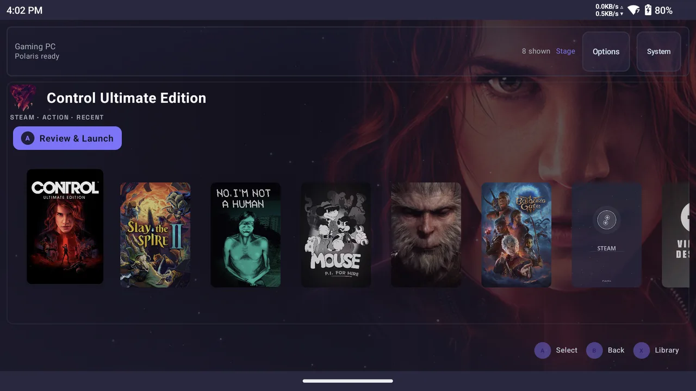
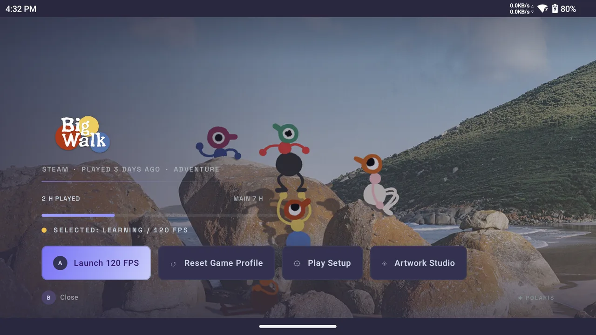
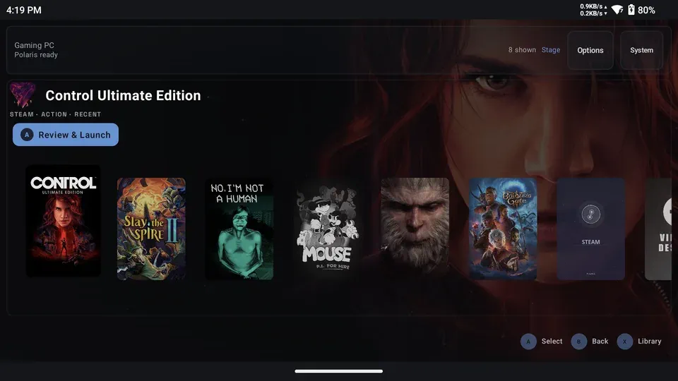
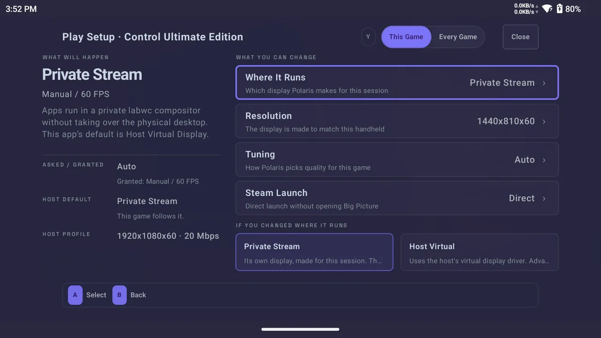
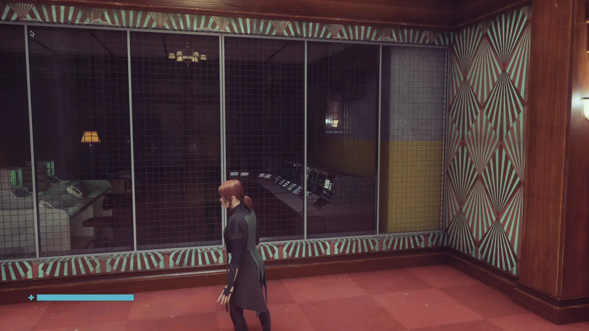
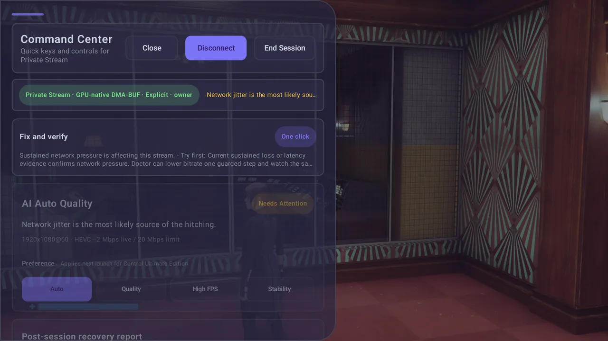

<picture>
  <source media="(prefers-color-scheme: dark)" srcset="docs/screenshots/Polaris_icon_1_dark.svg">
  
</picture>

# Nova

**Game streaming for Android handhelds that understands the host.**

Nova is an Android client for Polaris and standard Moonlight-compatible hosts.
With Polaris it turns a basic app grid into a controller-first Library, explains
each launch before it happens, and keeps live session controls close while you
play.

[**Explore Nova**](https://papi-ux.com/nova/) ·
[**Install ARM64**](https://github.com/papi-ux/nova/releases/latest/download/Nova-Android-arm64-v8a.apk) ·
[All releases](https://github.com/papi-ux/nova/releases/latest) ·
[Quick start](https://papi-ux.com/docs/nova/quickstart/)

> [!IMPORTANT]
> Nova is an Android app today. Android handhelds, phones, and Android TV are
> the supported client boundary; Nova is not a Windows, macOS, iOS, or native
> Linux client.

## A compatible client, with more context

| Normal compatible client | Nova with Polaris |
|---|---|
| Pairs, browses apps, launches, and streams | Adds a host-backed Library with art, sources, and launch health |
| Starts the host's configured app path | Shows Private Stream and other available display choices before launch |
| Treats a running session as a generic state | Distinguishes active, resumable, watchable, and owner-aware sessions |
| Offers basic disconnect or quit actions | Separates safe disconnect from ending the host session |
| Shows client-side stream statistics | Adds server-backed runtime truth, Doctor, tuning provenance, and NovaHUD |

Standard Moonlight-compatible hosts remain useful; Polaris supplies the richer
metadata and controls.

## Browse, decide, control

### Browse

Stage view puts the selected title into its landscape artwork while keeping the
row controller-readable. Control Ultimate Edition leads the Aurora showcase;
the [website gallery](https://papi-ux.com/nova/#themes) compares the same screen
in Portable Chrome, Console OLED, Miami Nebula, High Contrast, and Material You.

   
   
  <a href="https://papi-ux.com/nova/#themes">Compare every theme in the website gallery</a>

### Decide

Play Setup describes what will happen for this title: where it runs, the client
resolution, tuning policy, and Steam launch behavior. A session-scoped choice
does not silently rewrite the host default.

###  Control

During a stream, Command Center brings session health, Doctor guidance, tuning,
NovaHUD, input helpers, safe disconnect, and protected end-session actions into
a controller-first drawer.

Every capture above and across [papi-ux.com](https://papi-ux.com/nova/) comes from the tagged public release; the [pixel-level provenance manifest](https://papi-ux.com/images/products/showcase-v1.3.8-v1.3.6-provenance.json) ships with the site.

## Host compatibility

With a standard Moonlight-compatible host, Nova supports the familiar pairing,
Wake-on-LAN, app browsing, launch, input, and streaming path.

With Polaris, Nova additionally understands the host Library, display-mode
catalog, session owner, watch and resume behavior, per-session launch choices,
Polaris Sync, server-backed stream health, Doctor actions, and tuning state.
Those enhanced surfaces require compatible Polaris metadata; Nova falls back to
the standard path when it is not present.

## Install and start a first stream

&nbsp;

&nbsp;

&nbsp;

1. Install the public APK that matches the Android device.
2. Open **Servers**, discover or add the host, and pair.
3. Open the Library, review a title, and launch.
4. During play, open Command Center with Guide/Mode + Start/Menu. Guide/Mode + Y
   shows or cycles NovaHUD.

| Architecture | Direct download | Typical devices |
|---|---|---|
| ARM64 | [Nova-Android-arm64-v8a.apk](https://github.com/papi-ux/nova/releases/latest/download/Nova-Android-arm64-v8a.apk) | Most current handhelds, phones, Shield, and ARM64 Android TV |
| ARMv7 | [Nova-Android-armeabi-v7a.apk](https://github.com/papi-ux/nova/releases/latest/download/Nova-Android-armeabi-v7a.apk) | 32-bit ARM Android TV devices |
| x86_64 | [Nova-Android-x86_64.apk](https://github.com/papi-ux/nova/releases/latest/download/Nova-Android-x86_64.apk) | Android x86_64 devices and emulators |

The [quick-start guide](https://papi-ux.com/docs/nova/quickstart/) covers
Obtainium, pairing methods, first-stream controls, and architecture selection.

## Compatibility and platform boundaries

Nova preserves Android 5.0 / API 21 support, though features and codec behavior
depend on the device, Android build, decoder, controller mapping, network, and
host. Android handhelds are the primary experience; Android TV and phones are
supported with their own navigation constraints. Review the maintained [Nova
compatibility guide](https://papi-ux.com/docs/nova/compatibility/) for current
device, architecture, codec, HDR, sensor, and host notes.

## Documentation and project links

- [Nova documentation](https://papi-ux.com/docs/nova/) · [Quick start](https://papi-ux.com/docs/nova/quickstart/) · [Compatibility](https://papi-ux.com/docs/nova/compatibility/)
- [Roadmap](https://papi-ux.com/docs/roadmap/) · [Changelog](CHANGELOG.md) · [Releases](https://github.com/papi-ux/nova/releases)
- [Issues](https://github.com/papi-ux/nova/issues) · [Discussions](https://github.com/papi-ux/nova/discussions) · [Source](https://github.com/papi-ux/nova)
- [Security policy](SECURITY.md) · [Contributing](.github/CONTRIBUTING.md)

## Acknowledgments

Nova builds on the moonlight-android client lineage. Thanks to the Moonlight community for the foundation Nova grew from.

## AI Transparency

Nova is built and released by me, with assistance from tools such as OpenAI Codex, Claude, and local models.

I use those tools for documentation polish, release workflow cleanup, store-readiness checks, build/test triage, implementation review, and to compare approaches while debugging. They do not decide what Nova or Polaris are, what features ship, or what releases are published. I review, edit, build, test, and approve the changes before release, and I own the final engineering and trust-boundary decisions.

## Contributing

Contributions are welcome, especially focused fixes, UI polish, docs, translations, and careful feature work. Nova is still a small maintainer-led project, so the easiest pull requests to review are the ones that explain the problem clearly and keep the change scoped. See [CONTRIBUTING](.github/CONTRIBUTING.md) for the full workflow.

## License

Nova is free and open-source software licensed under the [GNU General Public
License v3.0](LICENSE.txt).

<picture>
  <source media="(prefers-color-scheme: dark)" srcset="docs/screenshots/Polaris_icon_1_dark.svg">
  
</picture>

[Website](https://papi-ux.com/nova/) · [Documentation](https://papi-ux.com/docs/nova/) · [Releases](https://github.com/papi-ux/nova/releases) · [Security](SECURITY.md)

