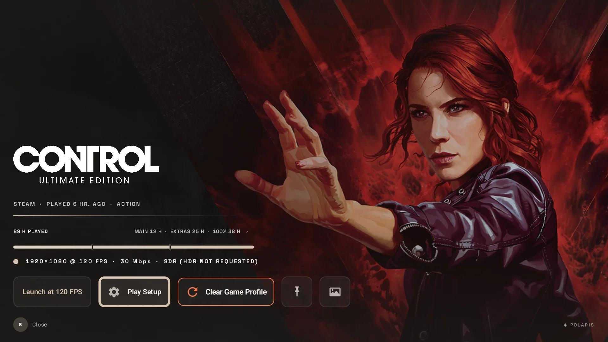
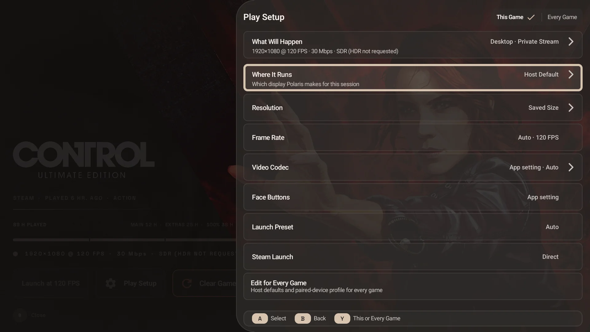
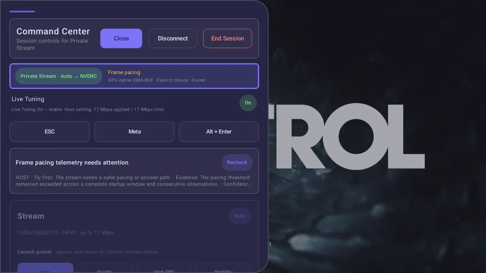

<div align="center">

<picture>
  <source media="(prefers-color-scheme: dark)" srcset="docs/screenshots/Polaris_icon_1_dark.svg">
  
</picture>

# Nova

**The streaming client that speaks host.**

Nova turns Android TVs, handhelds, tablets and phones, plus Linux desktops,
laptops and handhelds including Steam Deck, into a home for PC game streaming.
Pair it with Polaris for a controller-first Library, clear launch plans and live session controls. Standard Moonlight-compatible hosts remain supported
too.

[](https://github.com/papi-ux/nova/stargazers)
[](https://matrix.to/#/#papi-ux:papi-ux.com)
[](LICENSE.txt)
[](https://github.com/papi-ux/nova/releases/latest)

[**Explore Nova**](https://papi-ux.com/nova/) ·
[**Install ARM64**](https://github.com/papi-ux/nova/releases/latest/download/Nova-Android-arm64-v8a.apk) ·
[Join the Matrix community](https://matrix.to/#/#papi-ux:papi-ux.com) ·
[All releases](https://github.com/papi-ux/nova/releases) ·
[Quick start](https://papi-ux.com/docs/nova/quickstart/)

</div>


> [!IMPORTANT]
> Nova is available for Android and as **Nova Linux (Alpha)** for x86_64 Linux
> desktops, laptops and handhelds, including Steam Deck. Linux codec, HDR and
> frame-rate availability depends on the hardware, drivers, display and host.



*Android 1.4.14-beta.1 candidate; screenshot provenance is linked below.*

## Built for the whole player loop

Nova is matched to Polaris while retaining the standard Moonlight-compatible
path:

- **Review before play.** Play Setup shows resolution, frame rate, codec and
  where the game runs. Host-wide choices stay visibly host-wide.
- **Tiers fit the device.** Saver, Recommended, Max and Custom choose a client
  target, separately from Polaris's Auto, Quality, High FPS and Stability presets.
- **Make it yours.** Stage, Regular and Compact layouts support touch and
  controllers. Text and control size are independent; new installs start at
  80% text and existing choices stay intact.
  `< Congratulations, Director >` adds crimson, warm white and black
  ([appearance capture](docs/screenshots/nova-android-director-appearance-v1.4.14-beta.1.webp)).
- **Doctor uses current evidence.** Command Center separates client, network and
  host findings; Auto Fix requires a reversible, verifiable same-stream action.
- **Secondary tools stay secondary.** Pin to Home Screen and Artwork Studio use
  matching compact buttons beside the main game actions.
- **Host state stays bound to the game.** Stale launch contracts fail closed.
  Spaces name their launcher; Watch follows the running stream's own mode.

Read the [changelog](CHANGELOG.md) for the release-by-release change and
validation record.

## A compatible client, with more context

Standard Moonlight-compatible hosts support pairing, app browsing, Wake-on-LAN,
launch, input and streaming. Polaris adds library artwork and sources, launch
health, session ownership, Spaces, Watch, per-session choices, Polaris Sync,
Doctor and tuning provenance. Compatible host metadata enables these surfaces;
Nova keeps the standard path when it is absent.

## Browse, decide, control

### Browse

The game page above keeps Launch, Play Setup and Clear Game Profile together;
Pin to Home Screen and Artwork Studio use matching compact buttons.

Stage puts the selected title into its landscape artwork while keeping the row
controller-readable. Regular and Compact keep recent games in the main grid.
The [website gallery](https://papi-ux.com/nova/#themes) also shows Portable Chrome,
Console OLED, Miami Nebula, High Contrast and Material You.

### Decide

Play Setup names the display, resolution, frame rate, codec and launch policy.
Resolution and FPS stay independent. A named encoder is strict; Auto may fall back.
Per-session choices do not silently rewrite host defaults.



###  Control

During a stream, Command Center brings session health, Doctor guidance, tuning,
NovaHUD, input helpers, safe disconnect, and protected end-session actions into
a controller-first drawer.



The new game-page and Play Setup captures come from the **1.4.14-beta.1
candidate**, with exact source and image hashes in the
[screenshot manifest](docs/screenshots/beta1-readme-provenance.json). The Command
Center image remains a **1.4.9 reference**. Earlier website images retain their
[original provenance manifest](https://papi-ux.com/images/products/showcase-v1.3.8-v1.3.6-provenance.json);
a screenshot is not evidence that a beta has been published.


## Install and start a first stream

Choose [Android](#android) or [Nova Linux](#nova-linux-alpha). Stable downloads
use **Latest**; published betas appear separately under
[Releases](https://github.com/papi-ux/nova/releases).

### Android

<div align="center">

[](https://apps.obtainium.imranr.dev/redirect?r=obtainium://app/%7B%22id%22%3A%22com.papi.nova%22%2C%22url%22%3A%22https%3A%2F%2Fgithub.com%2Fpapi-ux%2Fnova%22%2C%22author%22%3A%22papi-ux%22%2C%22name%22%3A%22Nova%22%2C%22additionalSettings%22%3A%22%7B%5C%22apkFilterRegEx%5C%22%3A%5C%22Nova-Android-arm64-v8a%5C%5C%5C%5C.apk%24%5C%22%2C%5C%22versionExtractionRegEx%5C%22%3A%5C%22v%28.%2B%29%5C%22%2C%5C%22matchGroupToUse%5C%22%3A%5C%221%5C%22%7D%22%7D)
&nbsp;
[](https://github-store.org/app?repo=papi-ux/nova)
&nbsp;
[](https://github.com/papi-ux/nova/releases/latest)
&nbsp;
[](https://github.com/papi-ux/nova/releases/latest/download/Nova-Android-arm64-v8a.apk)

</div>

1. Install the public APK that matches the Android device.
2. Open **Hosts**, discover or add the host, and pair.
3. Open the Library, review a title, and launch.
4. During play, open Command Center with Guide/Mode + Start/Menu. Guide/Mode + Y
   shows or cycles NovaHUD.

| Architecture | Direct download | Typical devices |
|---|---|---|
| ARM64 | [Nova-Android-arm64-v8a.apk](https://github.com/papi-ux/nova/releases/latest/download/Nova-Android-arm64-v8a.apk) | Most current handhelds, phones and devices with ARM64 Android app support |
| ARMv7 | [Nova-Android-armeabi-v7a.apk](https://github.com/papi-ux/nova/releases/latest/download/Nova-Android-armeabi-v7a.apk) | 32-bit ARM Android devices, including Shield models with a 32-bit app ABI |
| x86_64 | [Nova-Android-x86_64.apk](https://github.com/papi-ux/nova/releases/latest/download/Nova-Android-x86_64.apk) | Android x86_64 devices and emulators |

Choose by the **Android app ABI**, not the processor name: a 64-bit CPU can
run a 32-bit Android build. Beta APKs use `Nova-Beta-Android-<ABI>.apk` and install
as Nova Beta beside stable, with separate app data.

Guides: [Quick start](https://papi-ux.com/docs/nova/quickstart/) ·
[Updates and beta releases](docs/updates.md).

### Nova Linux (Alpha)

Download `Nova-Linux-x86_64-alpha.flatpak` and its checksum from the chosen
[release](https://github.com/papi-ux/nova/releases), then install on Linux:

```bash
flatpak install --user ./Nova-Linux-x86_64-alpha.flatpak
flatpak run com.papi_ux.Nova --standalone
```

The standard 1.4.14 bundle includes experimental SDR PyroWave. Selecting it runs
a device check; Auto, H.264 and HEVC skip that check. Players using an older
separate PyroWave bundle should follow the
[migration guide](clients/deck/docs/pyrowave.md#packaging-and-compatibility).
Advice is a starting target, not a promise of sustainable network performance.

See the [Linux client guide](clients/deck/README.md),
[installation and Steam Input guide](clients/deck/packaging/flatpak/README.md), and
[compatibility roadmap](docs/linux-client-roadmap.md). Steam is optional; the
[Steam Deck guide](https://papi-ux.com/docs/nova/steam-deck/) covers Game Mode.
[Steam Frame](clients/deck/docs/steam-frame.md) has a separate experimental ARM64
development route; the x86_64 download does not run on Frame.

## Compatibility and platform boundaries

Nova preserves Android 5.0 / API 21 support, though features and codec behavior
depend on the device, Android build, decoder, controller mapping, network, and
host. Android handhelds are the primary experience; Android TV and phones are
supported with their own navigation constraints. Review the maintained [Nova
compatibility guide](https://papi-ux.com/docs/nova/compatibility/) for current
device, architecture, codec, HDR, sensor, and host notes.


## Documentation and project links

- [Spaces In Nova](docs/spaces.md): open your assigned gaming Space and adjust its stream settings.

- [Nova documentation](https://papi-ux.com/docs/nova/) · [Play Setup](https://papi-ux.com/docs/nova/play-setup/) · [Quick start](https://papi-ux.com/docs/nova/quickstart/) · [Compatibility](https://papi-ux.com/docs/nova/compatibility/)
- [Roadmap](https://papi-ux.com/docs/roadmap/) · [Changelog](CHANGELOG.md) · [Releases](https://github.com/papi-ux/nova/releases)
- [Matrix community](https://matrix.to/#/#papi-ux:papi-ux.com) · [Issues](https://github.com/papi-ux/nova/issues) · [Discussions](https://github.com/papi-ux/nova/discussions) · [Source](https://github.com/papi-ux/nova)
- [Security policy](SECURITY.md) · [Contributing](.github/CONTRIBUTING.md)

## Acknowledgments

Nova builds on the moonlight-android client lineage. Thanks to the Moonlight community for the foundation Nova grew from.

## AI Transparency

Nova is built and released by me, with assistance from tools such as OpenAI Codex, Claude, and local models.

I use those tools for documentation polish, release workflow cleanup, store-readiness checks, build/test triage, implementation review, and to compare approaches while debugging. They do not decide what Nova or Polaris are, what features ship, or what releases are published. I review, edit, build, test, and approve the changes before release, and I own the final engineering and trust-boundary decisions.

## Contributing

Contributions are welcome, especially focused fixes, UI polish, docs, translations, and careful feature work. Nova is still a small maintainer-led project, so the easiest pull requests to review are the ones that explain the problem clearly and keep the change scoped. See [CONTRIBUTING](.github/CONTRIBUTING.md) for the full workflow.

## License

Nova is free and open-source software licensed under the [GNU General Public
License v3.0](LICENSE.txt).

<div align="center">


<picture>
  <source media="(prefers-color-scheme: dark)" srcset="docs/screenshots/Polaris_icon_1_dark.svg">
  
</picture>

<sub>[Website](https://papi-ux.com/nova/) · [Matrix](https://matrix.to/#/#papi-ux:papi-ux.com) · [Documentation](https://papi-ux.com/docs/nova/) · [Releases](https://github.com/papi-ux/nova/releases) · [Security](SECURITY.md)</sub>

</div>
