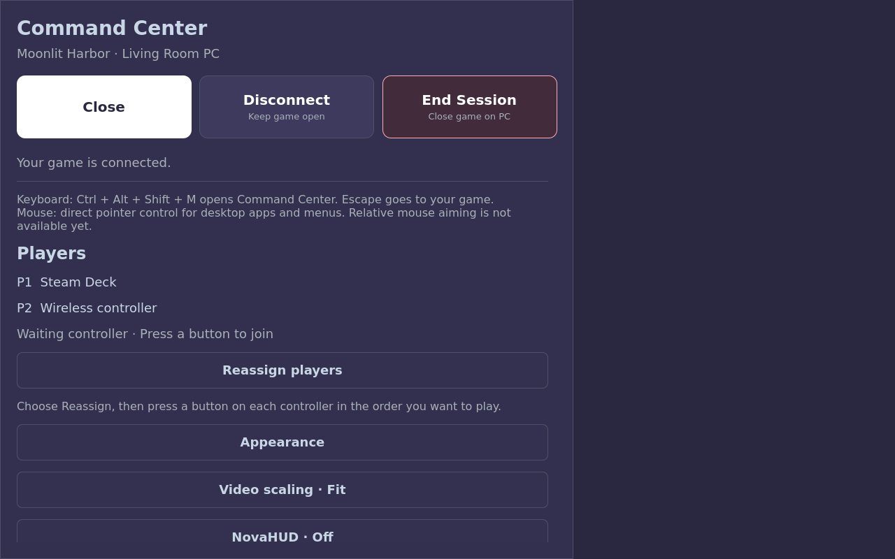
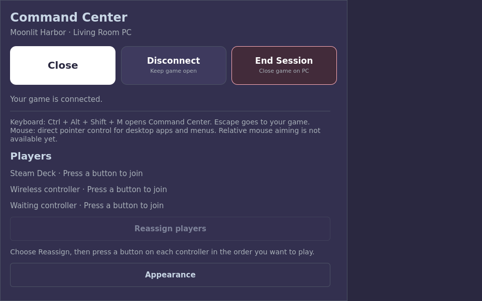

# Nova Deck development integration

The Deck client now includes a standalone library, native streaming session and
the accumulated Android v1.4.11 parity work. This is a development integration;
it does not declare a Deck release or complete Android parity. The
[capability inventory](deck-release-parity.md) retains the outstanding admission
requirements, and the [client guide](../clients/deck/README.md) describes each flow.

## Included player flows

- Native host identity, discovery/manual entry, PIN and Trusted Pair, saved PCs,
  standard-host libraries and scoped Polaris Desktop/Space libraries.
- Android-style Grid/Compact/Stage browsing, search/filter/sort, cached artwork,
  details, Play Setup, per-game choices, Artwork Studio and Steam game shortcuts.
- Native video/audio, Vulkan presentation and Quick overlays, controller players,
  rumble, adjustable stick deadzones, keyboard and direct mouse-pointer input.
- Command Center, hideable controls, Deck button glyphs, NovaHUD, Live Tuning,
  Doctor/Undo and sanitized reports, Polaris Sync and guarded host settings.
- Disconnect versus End game, reconnect, suspend/wake, held-input release,
  themes/text scaling, audio settings, Fit/Fill/Stretch and initial pacing choices.

The existing Android implementation and release metadata remain separate from
the Deck source changes. Pairing and host requests retain pinned identities,
permission checks and explicit mutation paths. The in-game keyboard shortcut is
Ctrl+Alt+Shift+M; plain Escape reaches the game. Mouse input currently follows the
displayed pointer, including scale/crop geometry, rather than relative aiming.

## Reproducing the software checks

With the Linux Qt, media and Vulkan dependencies installed:

```sh
cmake -S clients/deck -B build-deck -G Ninja \
  -DCMAKE_BUILD_TYPE=Debug \
  -DNOVA_DECK_BUILD_VULKAN_STREAM=ON \
  -DNOVA_DECK_BUILD_HDR_VALIDATION=ON
cmake --build build-deck --parallel 2
QT_QPA_PLATFORM=offscreen QT_QUICK_BACKEND=software \
  ctest --test-dir build-deck --output-on-failure
bash scripts/check-public-surface.sh
bash scripts/check-public-docs.sh
```

CI installs software Vulkan and Xvfb to exercise the native presentation, pixel
and window/UI checks without a physical Deck. Session and network fixtures use
isolated fake hosts; hardware-dependent checks can report a documented skip.
These results do not replace installed stream, audio, controller or HDR acceptance.

The local KDE SDK 6.10 candidate also passed the focused session/input/UI checks
and fixture/fresh-standalone startup under the matching Platform. Historical
`build/deck-*/EVIDENCE.md` references in the client guide and parity inventory name
local development artifacts; those binaries and raw logs are not repository files.

## Interface captures

These captures use synthetic fixture names and artwork, not a live host library.





## Still required

Relative mouse capture/aiming, touch/trackpad gestures, IME/layout and virtual-input
preferences, gyro and other advanced input remain open. Broader settings, remaining
pacing modes, Space API gaps, HDR90 and physical display/audio/controller acceptance
also remain on the inventory. The current Flatpak recipe and local preview bundle
are development packaging, not a signed public Deck release. Full installed
upgrade, soak, launch/stop and suspend/resume admission are still required.
