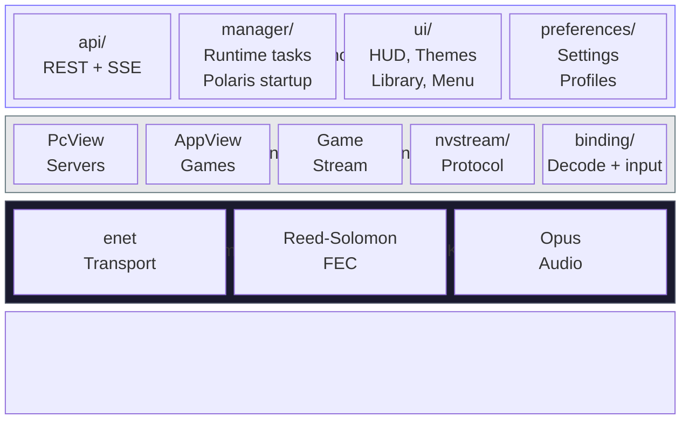

# Nova Technical Overview

Nova is an Android client with a Moonlight-compatible streaming core and a Kotlin layer for Nova-specific product behavior. The README stays focused on what users can do; this page keeps the source layout, build commands, and architecture details in one place.

## Architecture



All new Nova-specific behavior lives in the Kotlin layer where practical. The Java core stays close to Moonlight and is changed surgically.

## Source Layout

| Path | Purpose |
|---|---|
| `app/` | Shipping Android client |
| `app/src/main/java/com/papi/nova/api/` | Polaris REST and SSE integration |
| `app/src/main/java/com/papi/nova/manager/` | Runtime helpers and Polaris startup coordination |
| `app/src/main/java/com/papi/nova/preferences/` | Kotlin settings model, repository, profile override, and Compose UI |
| `app/src/main/java/com/papi/nova/ui/` | Nova Library, quick menu, HUD, themes, and Compose surfaces |
| `app/src/main/jni/moonlight-core/` | Moonlight native streaming submodule |
| `baselineprofile/` | Baseline Profile generation for release performance coverage |
| `docs/` | Packaging, performance, and technical notes |

Android is the only public release target today.

## Build Requirements

| Tool | Version |
|---|---|
| JDK | 17 |
| Android SDK | compileSdk 36 |
| Android NDK | 27.0.12077973 |
| Git | with submodule support |

## Clone

```bash
git clone --recursive https://github.com/papi-ux/nova.git
cd nova
```

If the repo was cloned without submodules:

```bash
git submodule update --init --recursive
```

## Build

```bash
# Release APKs
./gradlew assembleNonRoot_gameRelease

# Debug APKs, installed as com.papi.nova.debug
./gradlew assembleNonRoot_gameDebug
```

By default, local source builds produce split APKs for `arm64-v8a`, `armeabi-v7a`, and `x86_64`.

To override the ABI set locally:

```bash
./gradlew assembleNonRoot_gameDebug -PnovaAbis=arm64-v8a,armeabi-v7a,x86,x86_64
```

## Install A Local Build

Use the ABI-specific APK that matches your device from `app/build/outputs/apk/nonRoot_game/<buildType>/`.

Example for a real ARM64 device:

```bash
adb install -r app/build/outputs/apk/nonRoot_game/debug/app-nonRoot_game-arm64-v8a-debug.apk
```

## Build Flavors

| Flavor | Package | Notes |
|---|---|---|
| `nonRoot_game` | `com.papi.nova` | Standard release build |
| `nonRoot_gameDebug` | `com.papi.nova.debug` | Debug build, installs alongside release |

Official GitHub releases ship signed APKs for ARM64 devices, 32-bit ARM Android TV devices such as Chromecast with Google TV and Google TV Streamer, and x86_64 devices.

## Tests

```bash
./gradlew :app:testNonRoot_gameDebugUnitTest
```

For release readiness, pair focused unit coverage with a release assemble:

```bash
./gradlew :app:testNonRoot_gameDebugUnitTest :app:assembleNonRoot_gameRelease
```

## Release Performance Notes

Nova includes Baseline Profile generation infrastructure for startup and library flows. Release-performance evidence and current limitations are tracked in [Video Baseline Evidence](video_baseline_evidence.md).
